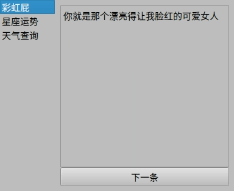

    

## Requirements
    python > 3.6
    pyqt5
    requests

## Run
    第一种：
        1. 先到 https://www.tianapi.com/ 注册一个账号，申请下星座的接口, 然后在 控制台-> 我的秘钥 中拿到 key
        2. git clone https://github.com/gwt805/pyqt5-funy.git 或者 下载zip
        3. 把 main.py 中 {os.getenv('API_KEY')} 替换为你的 key
        4. python main.py 就会弹出如下gif的界面啦
    第二种：
        在 https://github.com/gwt805/pyqt5-funy/releases 下载对应系统的可执行文件直接使用
## Other
    有问题可以联系我，QQ:1973735972

## v0.1.0-demo
